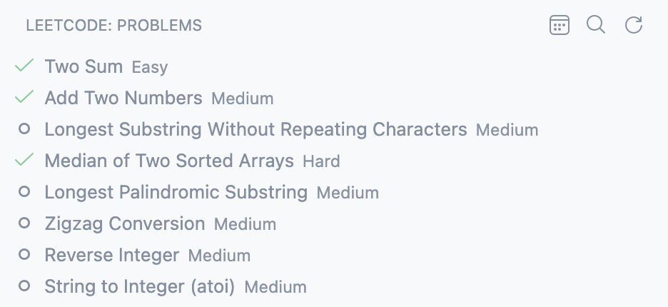
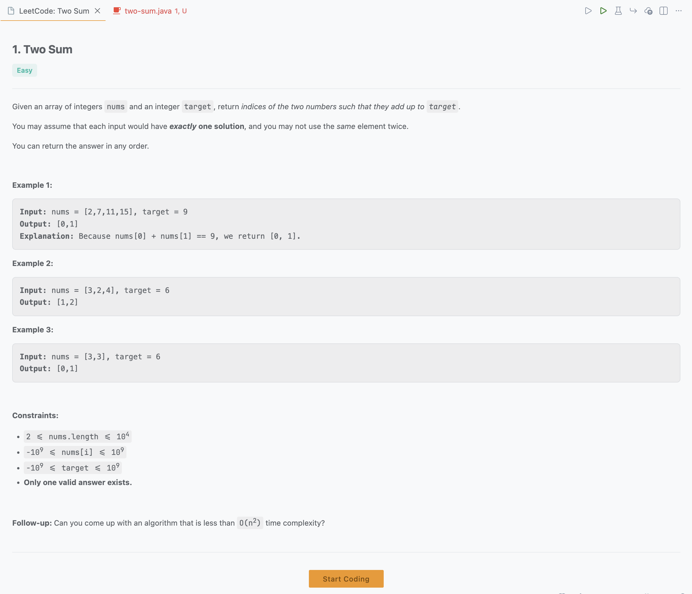
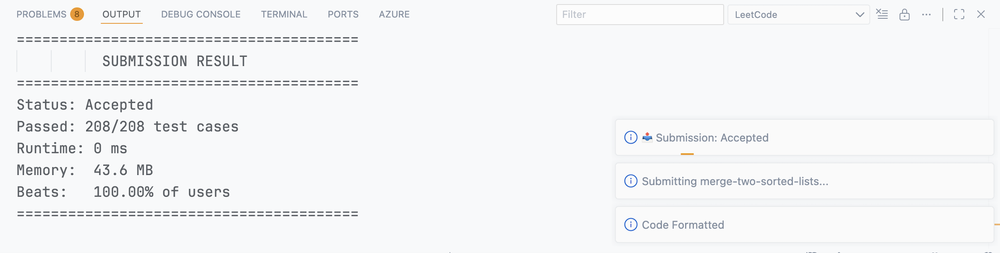

# LeetHelp

Solve LeetCode problems directly in VS Code. Browse, test, and submit — all without leaving your editor.


---

## ✨ Features

| Feature | Description |
|---------|-------------|
| 📂 **Problem Browser** | Browse and search all LeetCode problems from the sidebar |
| ▶️ **Run & Submit** | One-click buttons right above your code |
| 🌐 **18 Languages** | Python, Java, C++, JavaScript, Go, Rust, and more |
| 🧪 **Smart Test Cases** | Save failing tests — they auto-run with future tests |
| 📝 **Git Auto-Commit** | Accepted solutions are committed automatically |
| 🔒 **Secure Auth** | Cookie stored in your OS keychain, never in plain text |

---

## 📸 Interface Guide

### Sidebar — Problem Browser

Access LeetCode problems from the Activity Bar.



| Button | Action |
|--------|--------|
| 📅 | Open today's Daily Question |
| 🔍 | Search for any problem |
| 🔄 | Refresh problem list |

---

### Editor — CodeLens Buttons

Buttons appear directly above your solution code.


| Button | Action |
|--------|--------|
| **Run Test** | Run example tests + your saved custom tests |
| **Custom Test** | Run with your own input |
| **Format** | Format code (LeetCode style) |
| **Submit** | Submit solution to LeetCode |

---

### Problem View

View problem description, examples, and constraints. Click **Start Coding** to select your language.



---

### Test Results

See detailed test results with input/output comparison.



---

## 🚀 Quick Start

### 1. Sign In

1. Go to [leetcode.com](https://leetcode.com) and log in
2. Open DevTools (`F12`) → **Network** tab
3. Click any request → Copy the full **Cookie** header value
4. In VS Code: `Ctrl+Shift+P` / `Cmd+Shift+P` → `LeetHelp: Sign In` → Paste

> ⚠️ **Tip:** If you get 403 errors, your cookie expired. Just re-copy a fresh one.

### 2. Solve Problems

1. Open the **LeetCode** sidebar
2. Click a problem or use 🔍 to search
3. Click **Start Coding** and select your language
4. Write your solution
5. Click **Run Test** to test, then **Submit**

---

## ⌨️ Keyboard Shortcuts

| Shortcut (Win/Linux) | Shortcut (Mac) | Action |
|----------------------|----------------|--------|
| `Ctrl+Alt+R` | `Cmd+Alt+R` | Run Test |
| `Ctrl+Alt+C` | `Cmd+Alt+C` | Run Custom Test |
| `Ctrl+Alt+S` | `Cmd+Alt+S` | Submit |

---

## 📋 All Commands

Open Command Palette (`Ctrl+Shift+P` / `Cmd+Shift+P`) and type `LeetHelp`:

| Command | Description |
|---------|-------------|
| `LeetHelp: Sign In` | Authenticate with cookie |
| `LeetHelp: Sign Out` | Clear session |
| `LeetHelp: Auth Status` | Check login status |
| `LeetHelp: Verify Cookie` | Check if cookie is valid |
| `LeetHelp: Open Daily Question` | Open today's problem |
| `LeetHelp: Search Problem` | Find any problem |
| `LeetHelp: Run Test` | Run example + saved tests |
| `LeetHelp: Run Custom Test` | Run with custom input |
| `LeetHelp: Manage Saved Tests` | View/clear saved tests |
| `LeetHelp: Submit` | Submit solution |
| `LeetHelp: Format Code` | Format code (LeetCode style) |

---

## 🧪 Smart Test Cases

Failed a hidden test case? Save it and LeetHelp will automatically include it in future runs.

1. **Test fails** → Click **Save Test Case** in the notification
2. **Run again** → Saved tests run automatically with example tests
3. **All pass** → Prompted to clear saved tests

---

## 🛠️ Build from Source

```bash
git clone https://github.com/sidkm18/LeetHelper.git
cd LeetHelper
npm install
npm run compile
```

Press `F5` in VS Code to launch the Extension Development Host.

---

## 🐛 Troubleshooting

| Problem | Solution |
|---------|----------|
| 403 Forbidden | Re-copy your cookie — `cf_clearance` expired |
| Can't sign in | Make sure you copied the **full** Cookie header |
| Extension not loading | Reload VS Code window |

---

**[Report Issues](https://github.com/sidkm18/LeetHelper/issues)** · **[GitHub](https://github.com/sidkm18/LeetHelper)**

Made with ❤️ by [Sidharth](https://github.com/sidkm18)
